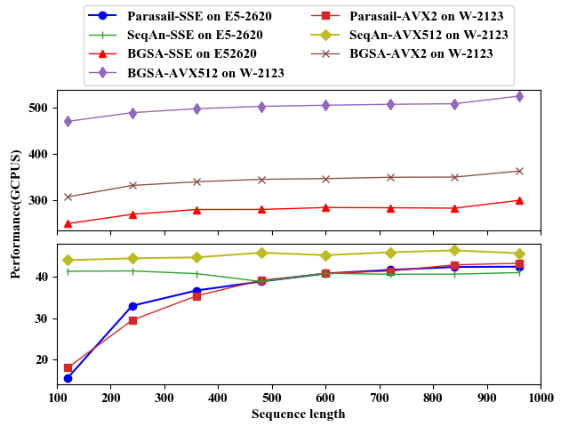
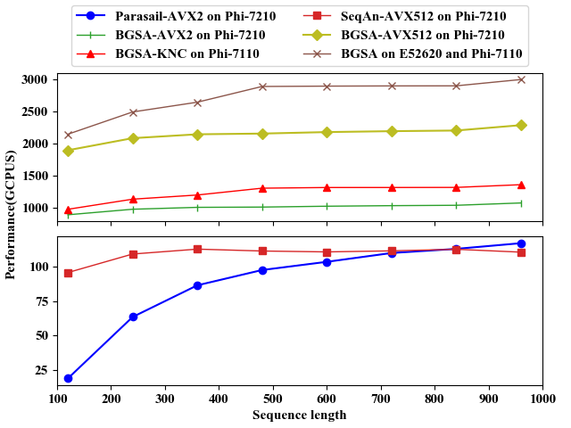

# BGSA
BGSA is a bit-parallel global sequence alignment toolkit for multi-core and many-core architectures. BGSA
supports both Myers algorithm (including the banded version) and BitPAl in order to gain fast speed of calculating unit-cost global alignments as well as global alignments with general integer scoring schemes.

## Contents

<!-- toc -->

- [Features](#features)
- [Usage](#usage)
- [Generator](#generator)
- [Performance](#performance)
- [Support or Contact](#support-or-contact)

<!-- tocstop -->

## Features
* Supports both **unit-cost global aligment([Myers algorithm](http://citeseerx.ist.psu.edu/viewdoc/download?doi=10.1.1.332.9395&rep=rep1&type=pdf))** and **general integer scoring global aligment([BitPAl algorithm](https://www.ncbi.nlm.nih.gov/pubmed/25075119))**.
* Supports both **global and semi-global aligment**.
* It also implements the **banded Myers algorithm** for fast verification under a given error threshold _e_;
* **Supports multiple SIMD intrinsics**: SSE, AVX2, KNC and AVX512. It also supports **heterogeneous platform** that contains KNC and CPU.
* The parallel framework can **extend to other similar algorithm easily** with a little change.
* **Super faster** than other similar softwares.

## Usage
* Step 1: Use the _generator_ program to  generate the kernel source with your specified score and architecture. And you need the Java runtime 1.7 or higher.
	```
	cd generator
	java -jar generator.jar -M 2 -I -3 -G -5 -a sse
	```

* Step 2: Move the generated file to the BGSA source folder accroding to your selected architecture, and then run `make` command. 
	```
	mv generated/align_core.c ../original/BGSA_SSE/
	cd ../original/BGSA_SSE/
	make
	```
	The default compiler is icc and CPU platform. You can pass `arch=KNL` for KNL platform and `cc=gcc` for other compilers.
	```
	# use gcc compiler on KNL platform
	make arch=KNL cc=gcc
	```

* Step 3: Run a test.
	```
	./aligner -q sample-data/query.txt -d sample-data/subject.txt -f data/result.txt
	```

* Step 4: Convert the result file to readable format.
	```
	./convert -r data/result.txt
	```

## Generator
We provide a code generator written in Java to quickly generate algorithm kernel source for a wide variety of devices as well as different scoring schemes. The following are the parameters of the generator module:

```
-M,--match <arg>:             Specify the match score which should be positive or zero. Default is 2.

-I,--mismatch <arg>:          Specify the mismatch score which should be negative. Default is -3.

-G,--gap <arg>:               Specify the gap score which should be negative. Default is -5.

-d,--directory <arg>:         Specify the directory where to place generated source files.

-n,--name <arg>:              Set the name of generated source file.

-t,--type <arg>:              Set BitPAl algorithm type. Valid values are: non-packed, packed. Default is packed.

-m,--myers:                   Using Myers' algorithm. Valid values are: 0, 1. 0 presents weights(0, -1, -1) and 1 presents weights(0, 1, 1). Default is 0.

-a,--arch:                    Specify the SIMD architecture. Valid values are: none, sse, avx2, knc, avx512. Default is sse. If you want generate kernel source for multiple architectures, you can use '-' to join them as none-sse-avx2

-e,--element:                 Specify vector element size. Valid value is 64, 32, 16, 8. Default is 32.

-s,--semi:                    Using semi-global algorithm.

-b,--banded:                  Using banded myers algorithm.

-h,--help:                    Display help Information.
```

## Performance

The following figures show the performance comparison of BGSA, Parasail and SeqAn on CPU and Xeon Phi platforms for unit scoring scheme. From the figures, we can see that the performance of BGSA is much faster than that of the other two algorithms. For more performance evluations, you can see our paper(under submission).


> Comparison on E5-2620 and W-2123


> Comparison on Phi-7110 and Phi-7210

## Use BGSA in your project
You can use BGSA in your project by directly copying header and source files. For simplicity, you can first save the seqeunces to be compared into temporary files, and then call BGSA to read sequences from the temporary files, calcuate alignment scores and save them to a result file, and finally your program can read the scores from the result file. You can also modify the input and output logic for more flexible and efficient. 

If you just need to use the kenerl alignment method, you can just copy `align_core.h` `align_core.c` `config.h` into your project. It is important to note that you need to process your data into the format required by this method. 

## Support or Contact

If you have any questions, please contact: Weiguo,Liu ( weiguo.liu@sdu.edu.cn).
